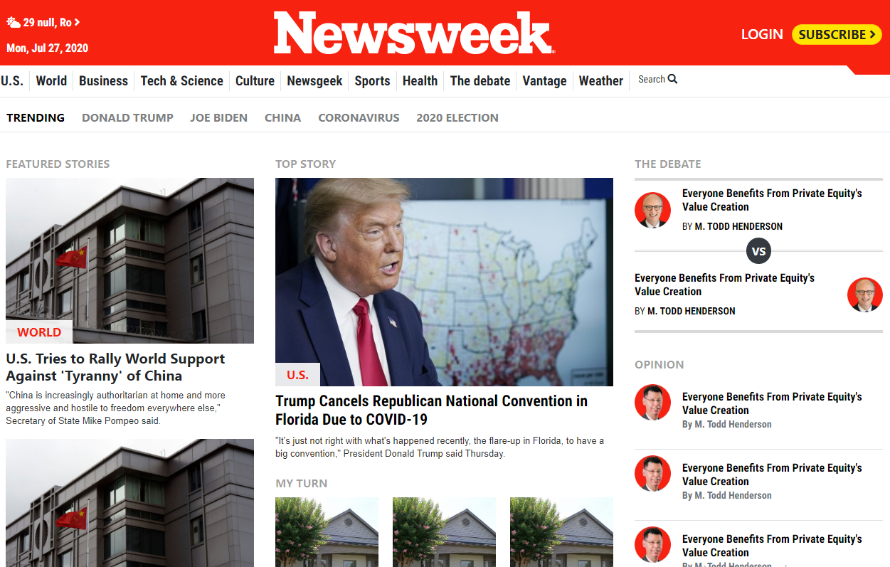

# Microverse project: Using Bootstrap - Replica of the news site Newsweek.com

> This is a Newsweek homepage page clone using HTML and CSS3.

## Screenshots of our clone website

## Link to the original website

[Original version](https://www.newsweek.com/)

The project is built using Html and CSS with an extensive use of the Bootstrap CSS framework, flex and grid positioning.

## Built With

- HTML
- CSS3
- Bootstrap
- Font awesome icons

## Live Demo

[Live Demo Link](https://raw.githack.com/cristianCeamatu/microverse-news-week-clone/feature-branch/index.html)

## To get a local copy up and running follow these simple example steps.

### Setup

Clone the project locally.

### Linters

1. run `npm install`.
2. run `npm run test` to check the Html and Css files.

### Deployment

Install and run a live server plugin on you IDE/Text editor and run it from the root directory.

## Authors

👤 **Cristian Viorel Ceamatu**

- Github: [@gcristianCeamatu](https://github.com/cristianCeamatu)
- Twitter: [@CeamatuV](https://twitter.com/CeamatuV)
- Linkedin: [@Ceamatu-Cristian](https://www.linkedin.com/in/ceamatu-cristian-viorel-7a5469136/)

👤 **Popoola Grace Boluwatife**

- Github: [@GraceOyiza](https://github.com/GraceOyiza)
- Twitter: [@_PopsonGrace](https://twitter.com/_PopsonGrace)
- LinkedIn: [@grace](https://www.linkedin.com/in/grace-popoola)

## Show your support

Give a ⭐️ if you like this project!

## 📝 License

This project is [MIT](lic.url) licensed.
